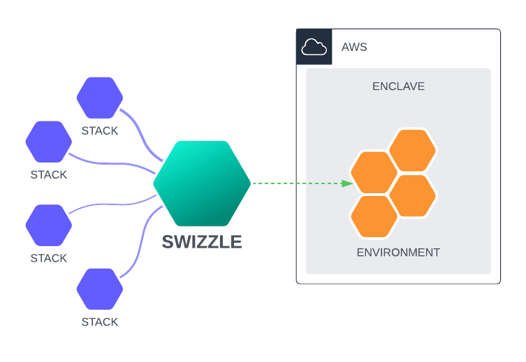

# Swizzle

Swiz allows you to orchestrate multiple infrastructure-as-code (IaC) environments. 



## 🤔 Understanding Swizzle

Distributed architectures often encounter a common problem: deploy time dependencies can arise. For instance, a shared 
infrastructure stack is frequently employed. However, when deploying a stack that relies on the shared infrastructure 
stack simultaneously, there is a risk of deployment failure due to a race condition between the stacks.

This application enables the sequencing of these deployments.

A stack, which represents a single service or deployment, constitutes the smallest possible unit. Generally, a stack is
associated with a single git repository.

An environment comprises multiple stacks and can serve as a product in production, development, testing, or PR 
(pull request) scenarios.

## 🚀 Getting Started

TODO:

## 🗂️ Config File Format

The behavior of swiz is defined by a set of configuration files. The file location definition currently supports:
* `file://` - A local file
* `https://` - A remote file

Additional support such as `s3://` and `git://` is planned.

#### app-config.yaml

The `app-config.yaml` file defines the main configuration for the application. This can be shared with other developers
using the `config export` command. This exports a base64 value that can be brought in using the `config import` command.

As part of the export and import, both a hash and word list are generated. The hash is used to verify that the config
has not been tampered with. Either can be used to verify the integrity of the config. Word lists are easier to verify
by humans.

```yaml
---
version: 1
default_env: SleepySleep
env_def:
  - name: SleepySleep
    env_def_file: file://env-def.yaml
disabled_commands: [version, config.generate]
```

Top Level Config:

| Field             | Description                                                                                    | Example                    |
|-------------------|------------------------------------------------------------------------------------------------|----------------------------|
| version           | Version of the configuration                                                                   | 1                          |
| default_env       | The name of the environment that should be used as the default                                 | SleepySleep                |
| disabled_commands | This is a list of commands that are disabled. This can be used to limit commands for usability | [version, config.generate] |

Environment Definitions (env_def). There can be multiple environment definitions:

| Field        | Description                                                     | Example             |
|--------------|-----------------------------------------------------------------|---------------------|
| name         | The name of the environment                                     | SleepySleep         |
| env_def_file | A URI to the file that contains further environment definitions | file://env-def.yaml |

#### env-def.yaml

The `env-def.yaml` file defines the environment. This file is specific to each environment and can be checked into
source control. Ideally a DevOps, Infrastructure, and/or security team owns this file to ensure that non-functional
requirements are met before a new stack is introduced into the environment.

```yaml
---
version: 1
default_enclave: dev
naming_scheme: "{{env_name:32}}-{{stack_name:32}}"
enclave_def:
  - name: dev
    default_provider: swiz-test
    default_iac: "Cloudformation"
    env_behavior:
      no_orphan_delete: true
      deploy_all_stacks: true
    providers:
      - name: swiz-test # Currently only a single provider is supported per enclave definition
        provider_id: AWS
        account_id: 123456789012
        region: us-east-1
    domain_name: example.com
    params:
      LogLevel: DEBUG
      VpcId: vpc-0123456789abcdef0
      DomainName: example.com
stack_cfg:
  - name: swizboot
    config_file: file://bootstrapstack-cfg.yaml
    order: 1
  - name: swizsleep
    config_file: file://sleepstack-cfg.yaml
    order: 2
```

Top-Level Config:

| Field           | Description                                       | Example                             |
|-----------------|---------------------------------------------------|-------------------------------------|
| version         | Version of the configuration                      | 1                                   |
| default_enclave | The name of the enclave to be used as the default | dev                                 |
| naming_scheme   | A format string for naming created resources      | "{{env_name:32}}-{{stack_name:32}}" |

For the naming_scheme, the following variables are available:
* env_name - The name of the environment
* stack_name - The name of the stack

The `:32` at the end allows you to truncate the names to a maximum of 32 characters. This is useful to avoid max
resource name limits.

Enclave Definitions (enclave_def):

| Field                          | Description                                                                      | Example          |
|--------------------------------|----------------------------------------------------------------------------------|------------------|
| name                           | The name of the enclave                                                          | dev              |
| default_provider               | The default provider to use for this enclave                                     | swiz-test        |
| default_iac                    | The default Infrastructure as Code (IaC) technology to use                       | "Cloudformation" |
| env_behavior.no_update_deploy  | This can optionally override the `deploy --no-update-deploy` parameter           | null             |
| env_behavior.no_orphan_delete  | This can optionally override the `delete --no-orphan-delete` parameter           | true             |
| env_behavior.deploy_all_stacks | This can optionally override the `deploy --deploy-all` parameter                 | true             |
| env_behavior.fast_delete       | This can optionally override the `delete --fast-delete` parameter                | null             |
| providers                      | A list of cloud providers (currently only one provider is supported per enclave) | -                |
| domain_name                    | The default domain name to use for resources in this enclave                     | example.com      |
| params                         | A set of default parameters to use when deploying resources                      | -                |

Provider Details (providers):

| Field       | Description                                       | Example      |
|-------------|---------------------------------------------------|--------------|
| name        | The name of the cloud provider                    | swiz-test    |
| provider_id | The ID that identifies the cloud provider         | AWS          |
| account_id  | The account ID for the cloud provider             | 123456789012 |
| region      | The region where the resources should be deployed | us-east-1    |

Parameters (params):

Each params field is a key value pair that gets passed down to each stack. This allows you to specify different values
per enclave (i.e. a dev enclave defaults to DEBUG logging, while a prod enclave defaults to INFO logging).

Stack Configuration (stack_cfg):

| Field       | Description                                                                                                                                                                         | Example                                                    |
|-------------|-------------------------------------------------------------------------------------------------------------------------------------------------------------------------------------|------------------------------------------------------------|
| name        | The name of the stack                                                                                                                                                               | swizboot, swizsleep                                        |
| config_file | A URI to the configuration file for this stack                                                                                                                                      | file://bootstrapstack-cfg.yaml, file://sleepstack-cfg.yaml |
| order       | An integer specifying the order in which the stacks should be deployed. Lower numbers get deployed first. If multiple stacks have the same value, they will be deployed in parallel | 1, 2                                                       |

#### sleepstack-cfg.yaml

```yaml
---
version: 1
template_file: file://sleepstack.yaml
params:
  SleepTestTime: 10
  SleepTestFunctionArn: "{{swizboot.SleepTestFunctionArn}}"
  LogLevel: "{{LogLevel}}"
  VpcId: "{{VpcId}}"
```

The naming convention is typically `<stack_name>-cfg.yaml`. This file is specific to each stack and can be checked into
source control. This file is used to specify the parameters for the stack.

Top-Level Configuration

| Field         | Description                                                             | Example                |
|---------------|-------------------------------------------------------------------------|------------------------|
| version       | Version of the configuration                                            | 1                      |
| template_file | A URI to the YAML file that is the CloudFormation (or similar) template | file://sleepstack.yaml |

Parameters (params):

Each params field is a key value pair that gets passed down to the CloudFormation template. This allows you to specify
explicit values or pull in global parameters defined per enclave. For example the `LogLevel` parameter defined in the
enclave will be passed to this stack. To pull in an output parameter, in this case the `SleepTestFunctionArn` from the
`swizboot` stack, you can use the `{{stack_name.output_name}}` syntax.

## 🦄 Best Practices (or How to Swizzle)

Since top 10's are all the rage ~~for clickbait~~, here's a list of the top 10 best practices for using Swizzle. There
is no scientific process that went into this, just ramblings from a maintainer.
1. Minimize dependency depth. Each stack should strive to be deployed independently and in parallel. A general pattern
   is to have a common stack that is deployed first, followed by the stacks that depend on it.
2. Use a single git repository per stack. This allows for the stack to be deployed independently of other stacks. Commit
   the `stack-cfg.yaml` alongside your IaC code in the same repo.
3. Commit the `env-def.yaml` file to a repo controlled by a DevOps, infrastructure and/or security team. While gate 
   keeping is not the goal, this promotes a culture of collaboration between development and teams that typically have
   to own non-functional requirements.
4. Don't boil the ocean. Great is the enemy of good. Start small and iterate.
5. Focus on eliminate the need to use the `deploy_all_stacks` flag. This flag is a sledgehammer and should be 
   used sparingly. It is a code smell that indicates that the stacks are not actually independent. Plus your AWS bill
   will thank you.
6. When a new stack is added to `env-def.yaml`, do an architecture and security review. It's easier to change things 
   before they get to production than when they are running in production.
7. Think about building out mock stacks for testing. This allows for testing of the deployment process without 
   incurring the cost of deploying the actual stack. Again, your AWS bill will thank you.
8. Use multiple enclaves and potentially build out a separate enclave for each development team. Each enclave should be
   its own AWS account.
9. Run a read-only dev test enclave in a different AWS account and region. Stacks should be tested in this account
   before getting promoted. This prevents pesky region hard coding bugs from creeping in. 
10. Figure out ways to limit resources by enclave to control costs. If deploying a dev test stack, then it probably
    doesn't need a prod sized database.

## 🗺️ Roadmap

The [product roadmap](https://github.com/orgs/swizzleio/projects/1) is kept here. The project follows the structure of
measuring debt, risk, features, and defects in the same roadmap.

* Debt: Technical debt that needs to be addressed.
* Risk: Risks that need to be addressed, such as proactively addressing security issues
* Features: New features that need to be added.
* Defects: Bugs that need to be fixed.

## 🙌 How to help out

If you want to say thanks and help support active development of Swizzle, you can do so by:
* Add a [GitHub Star](https://github.com/swizzleio/swiz) to the project.
* Tweet about the project on your [Twitter account](https://twitter.com/).
* Write about the project and how you are using it on [Reddit](https://reddit.com), [Medium](https://medium.com/), 
  [Dev.to](https://dev.to/) or your own blog.
* Let us brag about you here by adding your name to the [SUPPORTERS.md](SUPPORTERS.md) file.
* Provide insight into how you are using Swizzle by reaching out.

## 💻 Development

### ⚡️ Prerequisites

#### Core skills
* [Golang](https://golang.org/doc/) is the language used.
* [AWS](https://docs.aws.amazon.com/index.html) is one of the cloud providers.
* [IaC concepts](https://en.wikipedia.org/wiki/Infrastructure_as_code) since that's core to what's being built.
* [Git](https://git-scm.com/book/en/v2) is used for source control.

#### Libraries used
* [AWS SDK for go](https://aws.github.io/aws-sdk-go-v2/docs/) for talking to AWS. Services used are:
  * [Cloudformation](https://pkg.go.dev/github.com/aws/aws-sdk-go-v2/service/cloudformation)
  * [IAM](https://pkg.go.dev/github.com/aws/aws-sdk-go-v2/service/iam)
  * [Organizations](https://pkg.go.dev/github.com/aws/aws-sdk-go-v2/service/organizations)
  * [STS](https://pkg.go.dev/github.com/aws/aws-sdk-go-v2/service/sts)
* [Testify](https://pkg.go.dev/github.com/stretchr/testify) for testing.
* [Urfave CLI V2](https://cli.urfave.org/v2/getting-started/) as the CLI library.
* [YAML](https://pkg.go.dev/gopkg.in/yaml.v3) for parsing YAML files.
* [go-survey](https://github.com/go-survey/survey) for prompting the user for input.

### 🛠️ Building

The project uses Makefiles for building. Running `make` with no commands will print out the available commands. To build
the project, run `make build`. This will create a binary in the `out` directory.

### 🔬 Test Data

Sample test data is located in `test/data/cloudformation`. Create an AWS profile called `swiz-test` and deploy the 
stacks using the `swiz --appconfig file://test/data/cloudformation/app-config.yaml env deploy --name AwesomeEnv`
command.

The files are as follows:
* `app-config.yaml`: The application configuration file. This is typically located in the `~/.swiz` directory.
* `env-def.yaml`: The environment definition file. This is typically located in a git repository.
* `bootstrapstack-cfg.yaml`: The configuration file for the bootstrap stack. This is typically located in the same git
  repository as the IaC code in the `bootstrap.yaml` file.
* `bootstrap.yaml`: IaC code for the bootstrap stack. This is typically located in a git repository. The IaC code
  contains a lambda function and the ARN of the lambda function is used in the sleep stack. Swizzle passes the ARN
  to the sleepstack.
* `sleepstack-cfg.yaml`: The configuration file for the sleep stack. This is typically located in the same git
  repository as the IaC code in the `sleepstack.yaml` file. This also pulls common parameters and outputs from the
  bootstrap stack.
* `sleepstack.yaml`: IaC code for the sleep stack. This is typically located in a git repository.

### 🏗️ Structure

The project is structured as follows:
* `cmd`: The main entry point for the application. This is intended to be kept lightweight
* `internal`: Code internal to the application. Some code here will potentially be refactored into the `pkg` 
  directory in the future.
  * `internal/appconfig`: Application config handling
  * `internal/apperr`: Application specific errors
  * `internal/cmd`: Code for the CLI commands
  * `internal/environment`: Main business logic for the application. This does the actual processing of stacks and 
  environments
* `pkg`: Code that is not application specific.
  * `pkg/configutil`: Utilities that help configure the application. 
  * `pkg/drivers`: Helpers for external services such as the AWS API
  * `pkg/errtype`: Generic errors
  * `pkg/fileutil`: Helpers for file handling
  * `pkg/preprocessor`: Preprocessors for the IaC code. This code does variable substitution and other preprocessing.
  * `pkg/security`: Security related code such as signing code.
* `test`: Test files. [See above](#-Test-Data) for more information.
